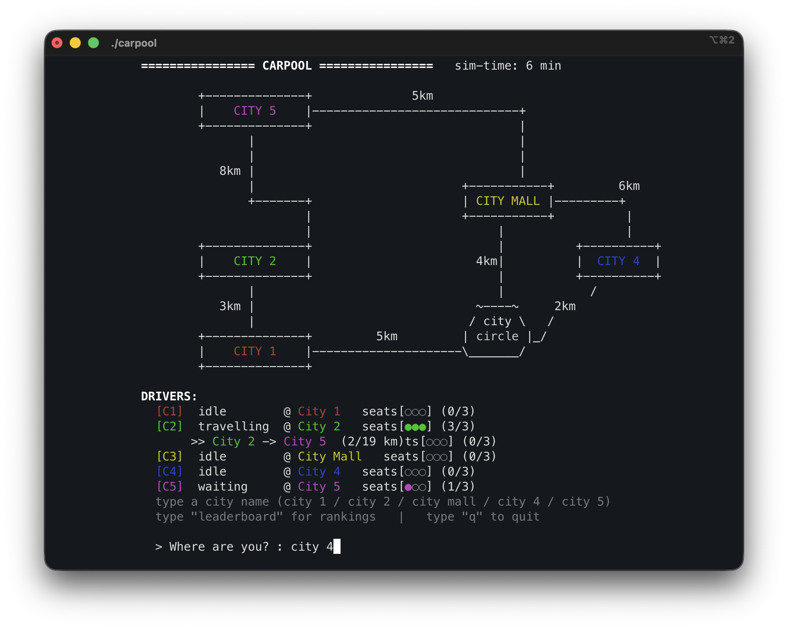
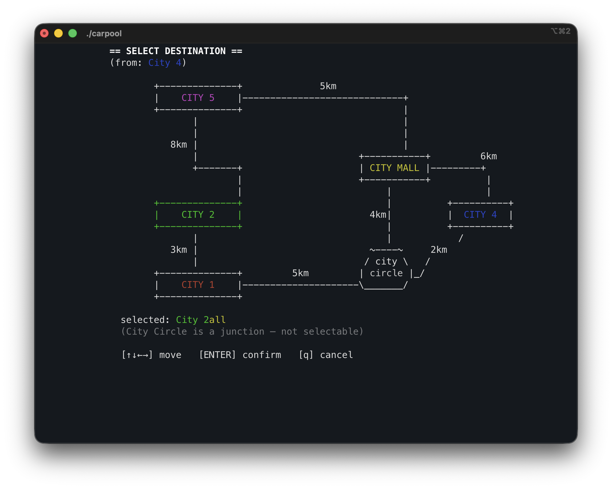
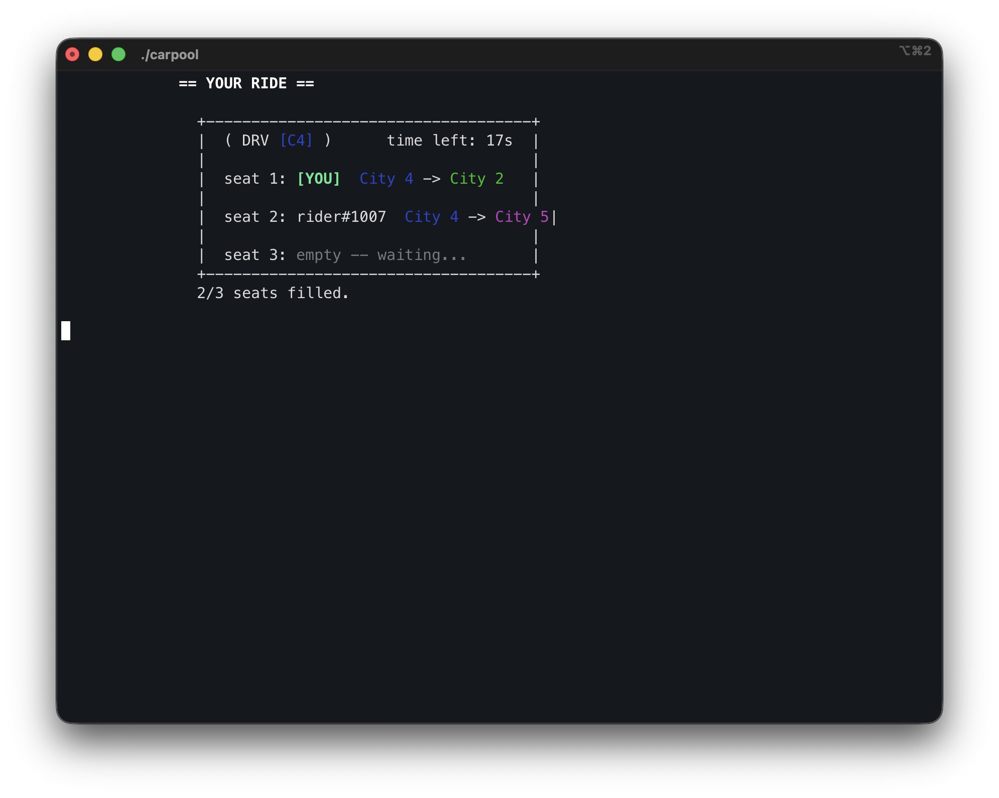
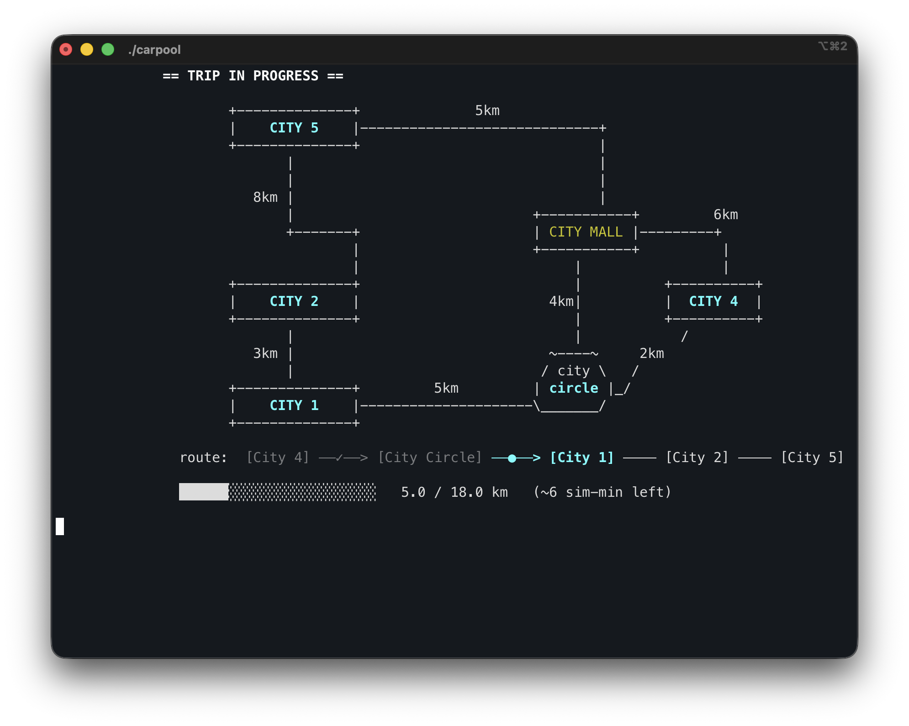
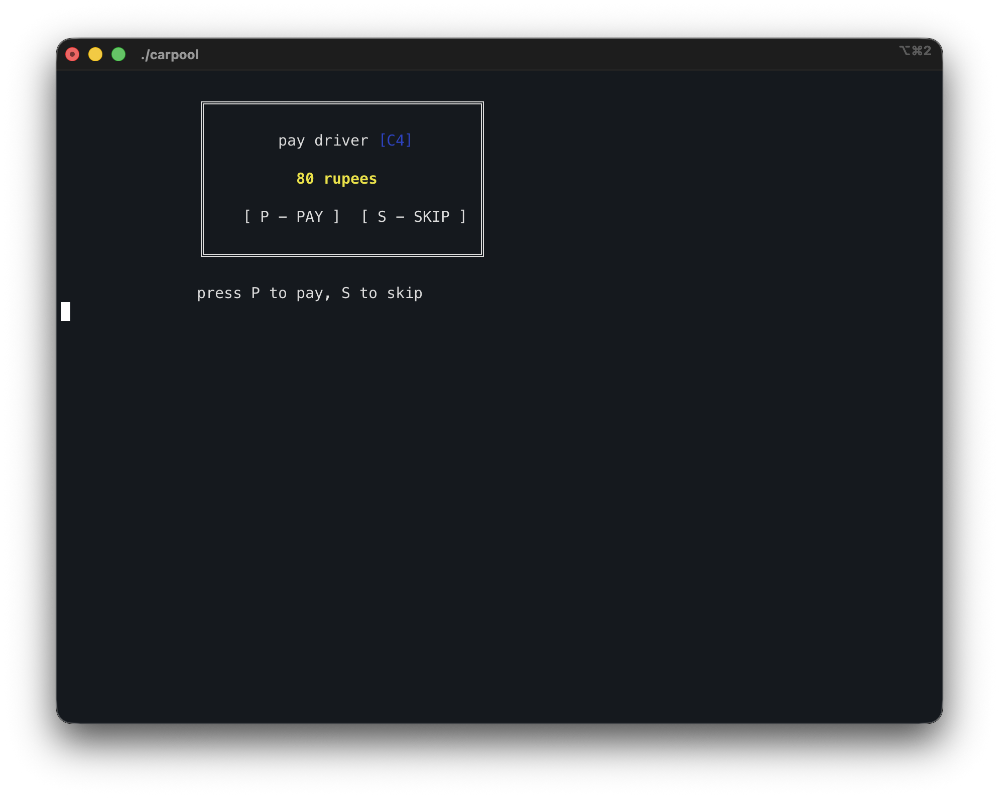
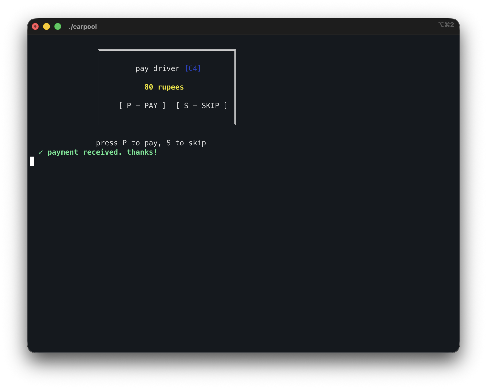
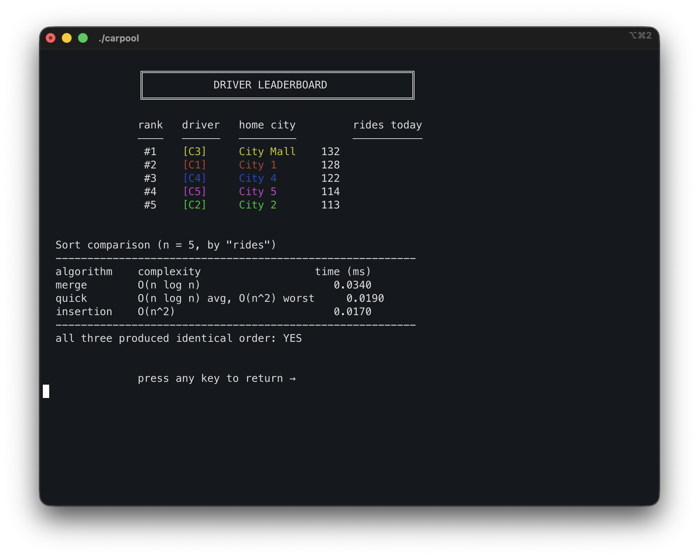

# 🚗 Carpool — Terminal Intercity Carpooling Simulator

A terminal-based intercity carpooling app written in **C++** for a DSA mini-project.  
Every data structure and algorithm has a **real job** — nothing is bolted on just to tick a box.

---

## Screenshots

### Home Screen — Live Map & Driver Dashboard
Cars update in real time: idle → waiting → travelling. The simulation runs in the background while you decide where to go.



---

### Destination Select — Arrow-Key Navigation
Navigate the map with arrow keys. Your source city is locked; pick any other city as your destination and press Enter.



---

### Seat Wait — Your Ride Card
Shows your seat, your co-passengers' routes, and a live countdown until the car departs.



---

### Trip In Progress — Route & Progress Bar
Tracks your car's live position along the multi-stop route with a km counter and estimated time remaining.



---

### Payment Screen
Your segment-calculated fare is shown at journey's end. Press `P` to pay or `S` to skip.



---

### Payment Confirmed



---

### Driver Leaderboard — Live Rankings + Sort Comparison
Ranks all drivers by rides served today using a BST. Also benchmarks Merge, Quick, and Insertion Sort and verifies all three produce identical rankings.



> **To use these screenshots:** save the 7 images into a `screenshots/` folder in the project root with the filenames above.

---

## What It Does

Five cities. Five drivers — one parked in each city. A customer says *"I'm in City 2, take me to City 5."*  
The app:
1. Matches them to a driver
2. Shares the ride with up to **2 other people** going roughly the same way
3. Picks the **best route** using Dijkstra + greedy chaining
4. Splits the cost **fairly** using a per-segment fare formula
5. Animates the **whole journey live in the terminal** — cars move, seats fill, time ticks

This is **intercity carpooling**, not door-to-door taxi. Everyone meets at the city pickup point.  
That's the design choice that keeps routing simple and the project finishable.

---

## Build & Run

```bash
cd CARPOOL/
g++ -std=c++11 *.cpp -o carpool
./carpool
```

> **Requires a real terminal** — uses `termios` raw mode + ANSI escape codes.  
> Tested on Linux/macOS. Does not work in VS Code's integrated terminal output pane.

### Controls

| Screen         | Key / Command     | Action                                          |
|----------------|-------------------|-------------------------------------------------|
| Home           | `city 1` … `city 5` / `city mall` | Start booking from that city    |
| Home           | `leaderboard`     | Show driver rankings                            |
| Home           | `q`               | Quit (auto-saves state)                         |
| Dest. Select   | `↑ ↓ ← →`        | Move highlight between cities                   |
| Dest. Select   | `Enter`           | Confirm destination                             |
| Dest. Select   | `q`               | Cancel, go back home                            |
| Waiting (queue)| `cancel` + Enter  | Leave the city queue, go back home              |
| Payment        | `P`               | Pay fare                                        |
| Payment        | `S`               | Skip / cancel payment                           |

### Saved State

- `data/drivers.txt` — driver state (auto-saved every ~60 s and on clean exit)
- `data/history.txt` — booking history (auto-saved every ~60 s and on clean exit)
- The `data/` directory is created automatically on first run.

Delete these files for a fresh start.

---

## Data Structures & Algorithms

Every DSA concept maps to a concrete job in the app:

| Concept              | Where                        | Why                                                                 |
|----------------------|------------------------------|---------------------------------------------------------------------|
| **Queue (FIFO)**     | `seatqueue.cpp`              | Hands out seats fairly — first come, first served                  |
| **Stack**            | `paymentstack.cpp`           | Per-person payments; unwinds in reverse if one fails (rollback)    |
| **Graph**            | `graph.cpp`                  | City map — 5 cities + 1 junction node (City Circle), adjacency list|
| **Dijkstra**         | `graph.cpp`                  | Shortest path between any two cities                               |
| **BFS**              | `graph.cpp`                  | Checks a city is reachable before Dijkstra runs; level-order on BST|
| **DFS**              | `graph.cpp` / `leaderboard.cpp` | Lists all paths; in-order BST traversal = DFS                  |
| **Greedy**           | `routing.cpp`                | Chains shortest paths to cover all 3 destinations (nearest-first)  |
| **BST**              | `leaderboard.cpp`            | Driver leaderboard keyed on rides served; O(log n) search          |
| **Merge / Quick / Insertion Sort** | `sorting.cpp` | Rank drivers/rides; timing comparison with Big-O printed          |
| **Linear + Binary Search** | `search.cpp`         | Find drivers by city (linear) or by ID (binary, precondition: sorted)|
| **Array**            | `datastore.cpp`              | Fixed pool of 5 drivers                                            |
| **Linked List**      | `datastore.cpp`              | Ride history (push_front), adjacency list in Graph                 |
| **File I/O**         | `datastore.cpp`              | Save/load drivers and history to `data/`                           |

---

## The Fair Fare Formula

The heart of the project. Naive equal-split is unfair — someone going a short hop shouldn't pay the same rate as someone riding the full route.

**The fix:** charge `RATE` per km on each **road segment**, split among only the people aboard *that segment*.

```
fare(person) = SUM over every segment they ride:
                   RATE × segment_km / (riders aboard that segment)
```

**Example** — route A→B→C→D, 10 km each, RATE = ₹21/km:

| Segment | Riders Aboard | Cost per person |
|---------|---------------|-----------------|
| A→B     | C1, C2, C3 (3)| ₹70             |
| B→C     | C1, C2 (2)   | ₹105            |
| C→D     | C1 (1)        | ₹210            |

- **C3** (short hop, always shared): **₹70**
- **C2** (mid-range): **₹175**
- **C1** (full route, lone tail): **₹385**
- **Driver always collects**: 70×3 + 105×2 + 210 = **₹630 = 21 × 30 km** ✓

---

## Simulation Constants

All shared constants live in `config.h`. Nobody hardcodes these anywhere else.

| Constant                  | Value | Meaning                                              |
|---------------------------|-------|------------------------------------------------------|
| `SPEED`                   | 2     | km per sim-minute (every car, fixed)                 |
| `TIME_SCALE`              | 0.5   | sim-minutes per real second                          |
| `RATE`                    | 21    | ₹ per km (full taxi rate, split per segment)         |
| `SEATS`                   | 3     | seats per driver                                     |
| `DRIVERS`                 | 5     | total drivers (one per city)                         |
| `CITIES`                  | 6     | map nodes (5 cities + 1 junction)                    |
| `WAIT_TIMEOUT`            | 10    | sim-minutes a half-empty car waits before leaving    |
| `SPAWN_INTERVAL`          | 5     | sim-minutes between ambient rider rolls (idle)       |
| `SPAWN_CHANCE`            | 70    | % chance a random rider appears on a roll (idle)     |
| `WAITING_SPAWN_INTERVAL`  | 2     | sim-minutes between spawns when a car is waiting     |
| `WAITING_SPAWN_CHANCE`    | 100   | % chance when a car is waiting — guaranteed          |

---

## The Departure Rule

Once the **first seat fills**, a timer starts. Every simulation tick checks:

```
All 3 seats full          → LEAVE NOW
10 min passed + ≥1 rider  → LEAVE with whoever's aboard (empty seats return to queue)
10 min passed + 0 riders  → CANCEL, car stays, no route computed
```

---

## The Ambient Home Screen

The home screen isn't static. Cars fill up, depart, drive real Dijkstra routes, complete, and return home — all on their own, before the user books anything.

- **Jumpstart** — 2 random cars are pre-seeded with riders at launch so the map is lively immediately.
- **Randomised city targeting** — a Fisher-Yates shuffle picks which idle cars get riders each spawn event, so all 5 cities see action rather than always filling C1 first.
- **Simultaneous boarding** — on each spawn event, 1–N idle cars are selected and each boards 1, 2, or 3 riders at once, producing a realistic mix of empty, half-full, and full departures.
- **Waiting-car fast lane** — once a car has its first rider, spawn interval drops to `WAITING_SPAWN_INTERVAL` and chance becomes `WAITING_SPAWN_CHANCE` (guaranteed) to fill it quickly.
- Uses the **same `tick()` and `assignSeat()`** as the real booking flow — no separate simulation path.

---

## Screens

| Screen           | What you see                                                         |
|------------------|----------------------------------------------------------------------|
| **Home**         | ASCII city map, cars `[C1]`–`[C5]` moving in real time              |
| **Map Select**   | Highlighted city selector (arrow keys), pick source then destination |
| **Seat Wait**    | Your seat `●`, other seats filling `○→●` live, driver info          |
| **Ride Sim**     | Car animating along its route, coloured path, live sim clock         |
| **Payment**      | Your fare breakdown, press `P` to pay                                |
| **Leaderboard**  | BST in-order → ranked driver table + sort algorithm timing comparison|

---

## File Structure

```
CARPOOL/
├── main.cpp              — screen state machine + glue (ST_HOME → ST_PAYMENT)
├── config.h              — frozen shared constants
├── types.h               — frozen shared structs (Driver, Customer, Booking, …)
│
├── datastore.{h,cpp}     — driver array, linked-list history, file save/load
├── seatqueue.{h,cpp}     — seat allocation queue (FIFO)
├── paymentstack.{h,cpp}  — per-person payment stack (pay + rollback)
├── sorting.{h,cpp}       — merge / quick / insertion sort + timing comparison
├── search.{h,cpp}        — linear search by city, binary search by ID
├── leaderboard.{h,cpp}   — BST keyed on rides-served, in-order + level-order
├── graph.{h,cpp}         — city graph + Dijkstra + BFS reachability + DFS all-paths
├── routing.{h,cpp}       — multi-destination greedy route + segment fare formula
├── simulation.{h,cpp}    — time tick, car movement, ambient random rider spawn
└── ui.{h,cpp}            — termios raw mode, ANSI rendering, all draw* screens
data/
├── drivers.txt           — persisted driver state
└── history.txt           — persisted booking history
```

### Dependency Order (top = most independent)

```
config.h + types.h
       │
  ┌────┴──────────────────────┐
datastore   sorting/search/BST   graph
  (P1)           (P3)            (LEAD)
                                   │
                                routing (LEAD)
                                   │
            ┌──────────────────────┤
       seatqueue/paystack      simulation
           (P2)                  (LEAD)
                                   │
                                 main (LEAD)  ← only place everything meets
```

Most modules are **islands** — Dijkstra doesn't know about seats, sorting doesn't know about the map. Test your part independently with fake data; integration is just plugging functions together.

---

## Known Issues

- `isOnSegment` uses the **first** index of each city in `fullPath`. Fine for our routes (no revisited cities in practice). If a route ever revisits a city, fare attribution may be slightly off.
- The spec's `tick()` called `returnSeats()` on partial departure, which would have duplicated queue slots. Fixed: `tick()` purges the departing driver's leftover slots via a `purgeDriverSeats` helper; `completeTrip()` returns all 3 seats when the car comes home. Queue stays balanced at exactly 15 slots.

---

## Viva Quick-Reference

| Question                   | Answer                                                                 |
|----------------------------|------------------------------------------------------------------------|
| Why a queue for seats?     | FIFO — whoever asked first gets the next free seat, guaranteed fair    |
| Why a stack for payments?  | Payments commit in order; if one fails, the stack unwinds in reverse (atomic rollback) |
| Why greedy for routing?    | At each step, go to the *nearest* unvisited destination — O(D²) where D ≤ 3, optimal for small D |
| Why BST for leaderboard?   | Insert / search in O(log n); in-order traversal gives sorted ranking for free (that's DFS) |
| What's the fare guarantee? | Driver always collects exactly RATE × total_km, regardless of how riders share |
| BFS vs DFS?                | BFS = level-order on BST + reachability check; DFS = in-order traversal + all-paths listing |
